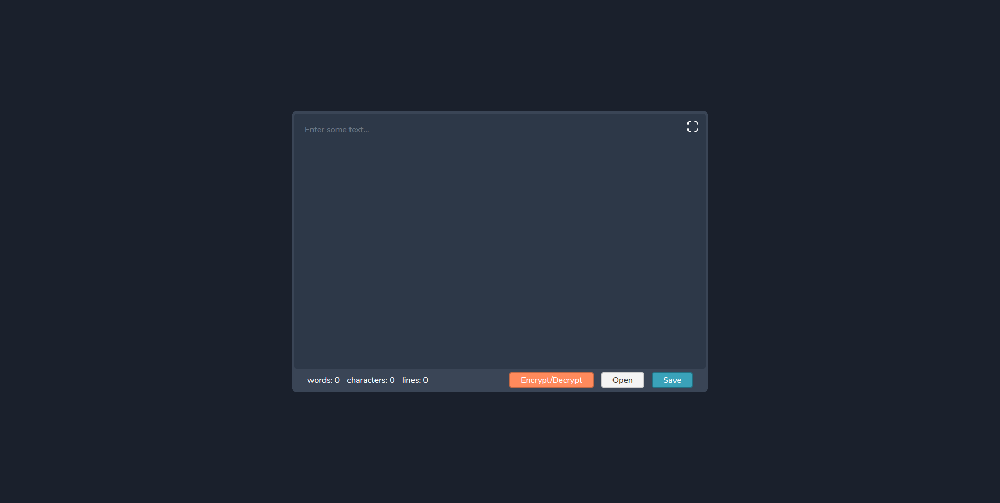

# Tekstiredaktor

Tekstiredaktor is a simple PWA plain text editor.

You can view the live app at [Tekstiredaktor](https://tekstiredaktor.web.app).

## Available Scripts

### Installs the dependencies

```
yarn install
```

### Runs the app in the development mode

```
yarn dev
```

Open [http://localhost:5000](http://localhost:5000) to view it in the browser.

## Technologies
Project is created with:
* Svelte
* SCSS
* Firebase

## Screenshot of the app
